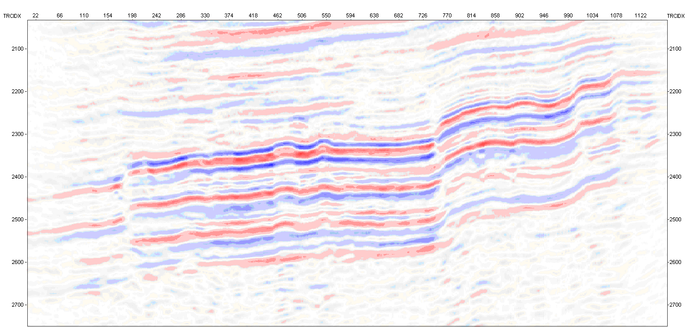

[back to top](./index.html).
# Введение

*Целью нашего курса является получить навыки самотсоятельногло анализа сейсмичких данных включая:*
* понимание математической основы используемых процедур и алгоритмов
* навыки самостоятельной работы в современном программном обеспечении
* навыки собвенно гелогичесской интепретации волновго поля и каротажа
* умение самостоятельного программирования алгоритмов и процедур обработки сейсмических данных

## Отвечаем на вопросы

  
Какие основные результаты мы можем получить анализируя сейсмические данные?

 	_1. морфология горизонтов
	_2. упругие свойства горных пород
	_3. положение разрывных нарушений
	_4. тип насыщения
	_5. фациальные условия (литологические границы, отдельные геологические объекты)

## Смотрим примеры волновых полей

  
Укажите какие  гелогические объекты можно интепретировать в волновом поле

 

	Пример 2. Оренбургское месторождение (Западная Сибирь)

	Пример 3. Вынгапуровское месторождение (Западная Сибирь)

	Пример 5. Солнечное месторождение (Оренбургская область)

* Какие этапы работы нам нужно выполнить, чтобы получить результаты о готорых только что говорили?
	
	* Структурная интерпретация сейсмических данных
		* Загрузка сейсмических данных
		* Сейсмостратиграфическая привязка ОГ
		* Корреляция ОГ
		* Трассирование тектонических нарушений
		* Выбор глубинно-скоростной модели, построение карт скоростей
		* Построение структурных карт по ОГ и кровлям пластов
	* Динамическая интерпретация
		* Атрибутный анализ сейсмической записи 
		* Акустическая инверсия
		* Сейсмофациальный анализ
		* Прогноз коллекторских свойств

# Инструменты для анализа данных
1. Комплексы программ для интепретации данных
2. Геоинформационные системы
3. Языки программирования

[back to top](./index.html).